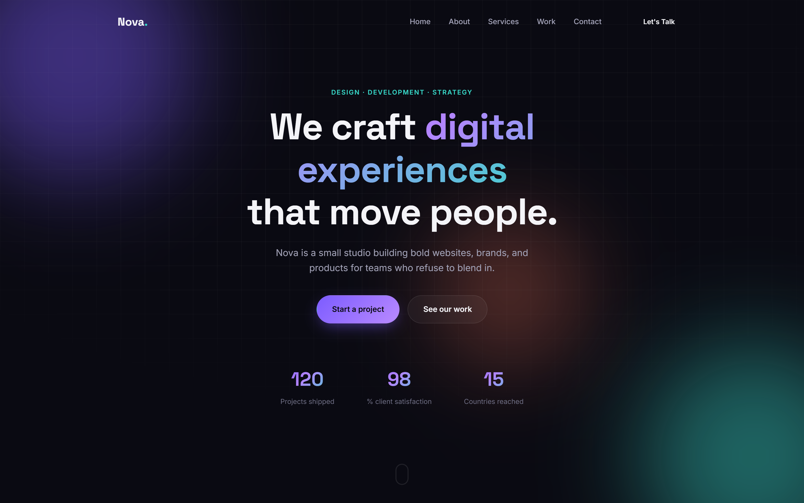

# Nova — Digital Studio

**A single-page marketing/portfolio site template for a design & development studio.**



Hero, about, services, work/portfolio, and contact — all on one scrolling page with smooth anchor navigation.

---

## Overview

Nova is a static, dependency-free single-page site built for studios and freelancers who want a polished, animated online presence without a framework, bundler, or backend. Drop in your own copy, plug in an EmailJS account, and deploy anywhere that serves static files.

## Table of Contents

- [Tech Stack](#tech-stack)
- [Features](#features)
  - [Design](#design)
  - [Motion & Interactivity](#motion--interactivity)
  - [Contact Form](#contact-form)
- [Getting Started](#getting-started)
- [Deployment](#deployment)
- [EmailJS Setup](#emailjs-setup)

## Tech Stack

| Layer | Technology | Notes |
|---|---|---|
| Structure | **HTML5** | Semantic single-page structure |
| Styling | **CSS3** | Custom properties (design tokens), Grid/Flexbox, keyframe animations — no framework |
| Behavior | **Vanilla JavaScript** | No build step, no dependencies beyond one CDN script |
| Email | **[EmailJS](https://www.emailjs.com/) (`@emailjs/browser`)** | Sends real contact-form emails without a backend server |
| Typography | **Google Fonts** | [Space Grotesk](https://fonts.google.com/specimen/Space+Grotesk) (headings) + [Inter](https://fonts.google.com/specimen/Inter) (body) |
| Hosting | **Static files** | Deployable anywhere — Netlify, Vercel, GitHub Pages, S3, etc. |

## Features

### Design

- Dark theme with purple/teal/coral gradient accents
- Glassmorphism cards, glowing animated background blobs, subtle grid overlay
- Mouse-follow cursor glow effect (desktop only)
- Fully responsive, with a mobile hamburger menu

### Motion & Interactivity

- Scroll-reveal animations on every section (`IntersectionObserver`-based)
- Animated stat counters that count up when scrolled into view
- Rotating headline text in the hero
- Scroll-aware navbar (adds blur/background on scroll)
- Smooth-scroll anchor navigation

### Contact Form

- Real-time inline validation with floating labels and error messages
- Sends real email via EmailJS (once you plug in your own Service ID / Template ID / Public Key)
- Loading spinner + success/error states
- Spam protection: hidden honeypot field + 60-second client-side submission cooldown

## Getting Started

1. **Clone or download** this repository.
2. **Add your content** in `index.html` (copy, images, links).
3. **Set up EmailJS**
   - Create a free account at [emailjs.com](https://www.emailjs.com/).
   - Create an Email Service and an Email Template.
   - In `script.js`, replace the placeholders with your own:
     ```js
     emailjs.init("YOUR_PUBLIC_KEY");
     // Service ID: "YOUR_SERVICE_ID"
     // Template ID: "YOUR_TEMPLATE_ID"
     ```
4. **Open `index.html`** in a browser — no build step or local server required.

## Deployment

Since Nova is pure static files, deploy it to any static host:

- **Netlify / Vercel** — drag and drop the folder or connect the repo
- **GitHub Pages** — enable Pages on this repo, serving from the root
- **S3 / any static bucket** — upload `index.html`, `styles.css`, and `script.js`

## EmailJS Setup

Nova's contact form uses [EmailJS's API](https://www.emailjs.com/) to send real email without a backend server.

1. Sign up at [emailjs.com](https://www.emailjs.com/) (free tier: 200 emails/month).
2. Add an **Email Service** (e.g. connect your Gmail) → copy the **Service ID**.
3. Create an **Email Template** with variables `{{name}}`, `{{email}}`, `{{subject}}`, `{{message}}` (matching the form's `name` attributes) → copy the **Template ID**.
4. Grab your **Public Key** from **Account → General**.

Then open `script.js` near the top and replace the three placeholders:

```js
const EMAILJS_PUBLIC_KEY = 'YOUR_PUBLIC_KEY';
const EMAILJS_SERVICE_ID = 'YOUR_SERVICE_ID';
const EMAILJS_TEMPLATE_ID = 'YOUR_TEMPLATE_ID';
```

Once those are real values, submissions will actually land in your inbox.

---

<p align="center">Built with HTML, CSS, and vanilla JavaScript — no framework required.</p>
